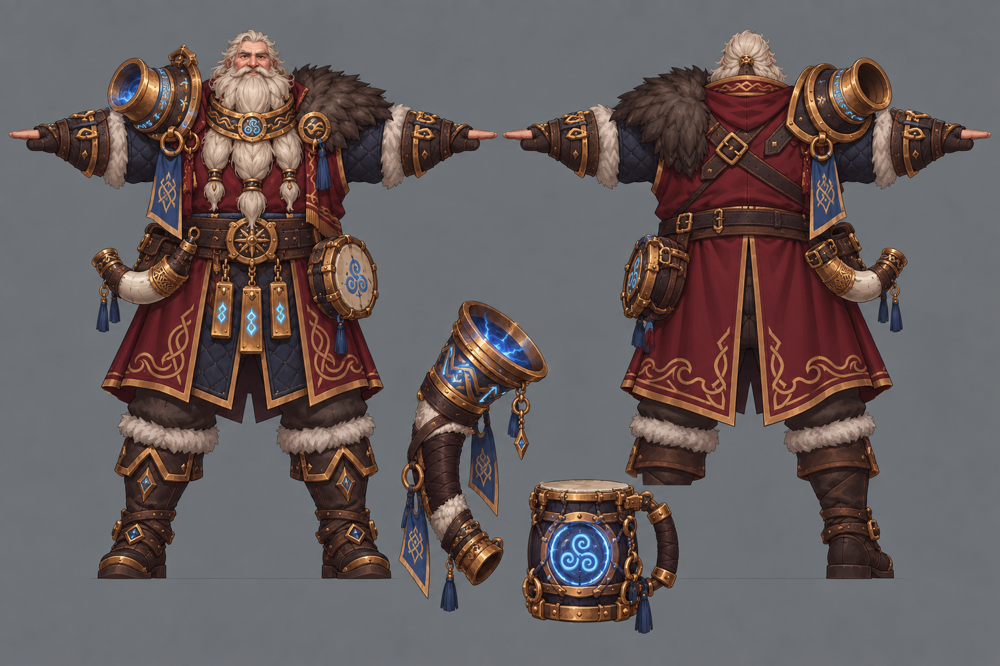
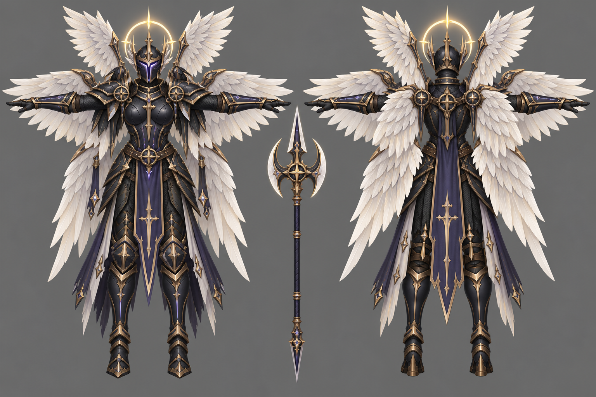
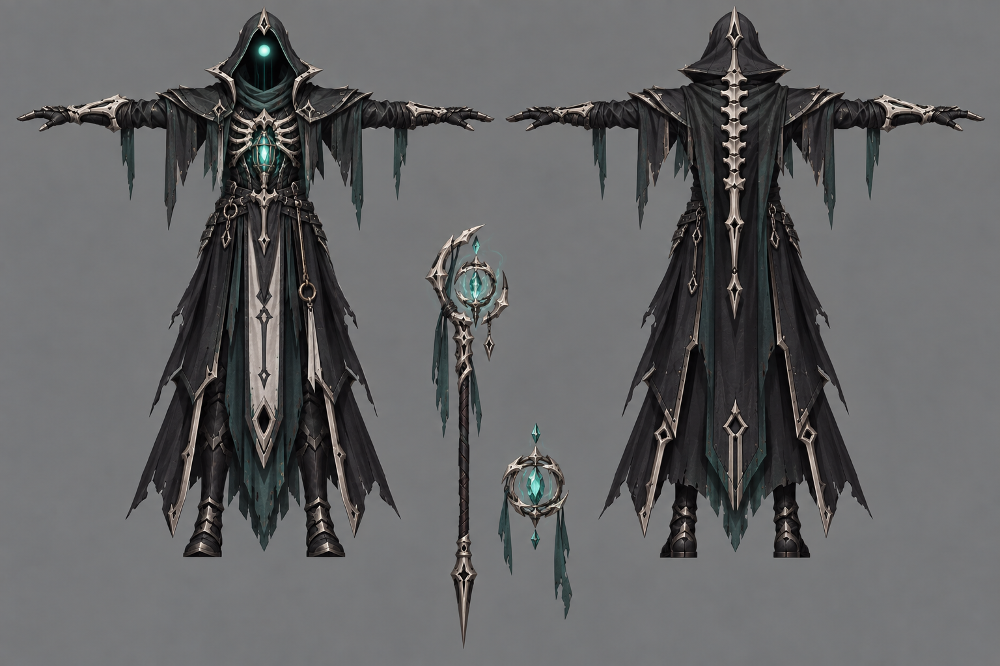
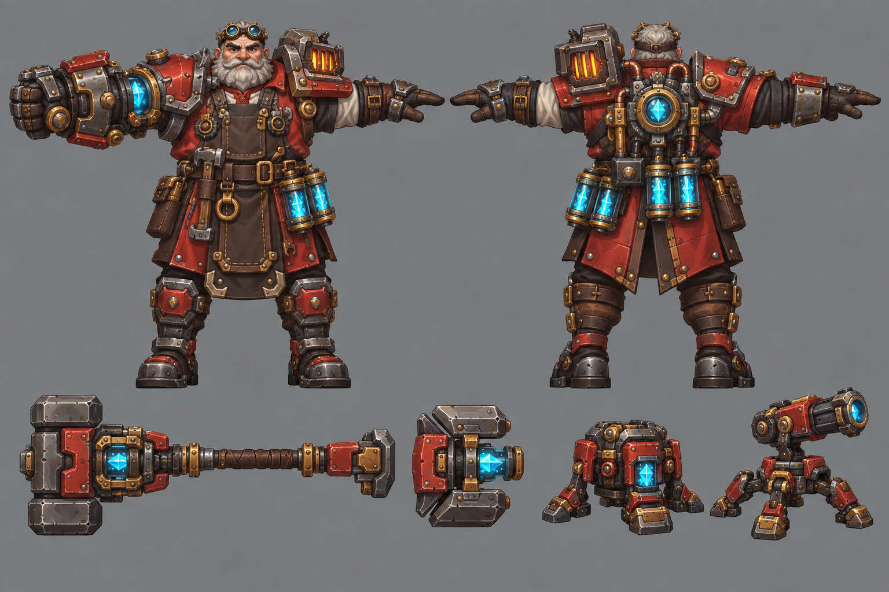
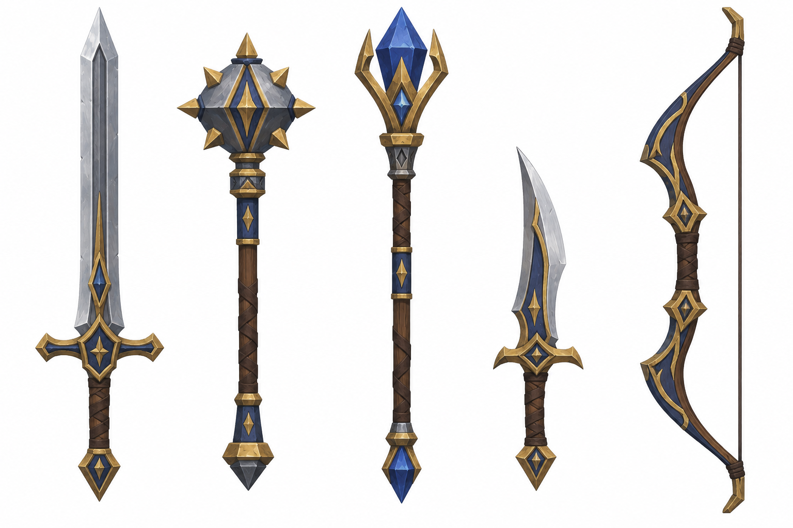
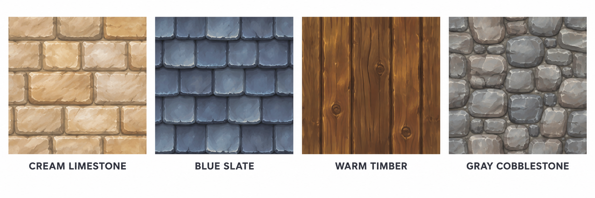
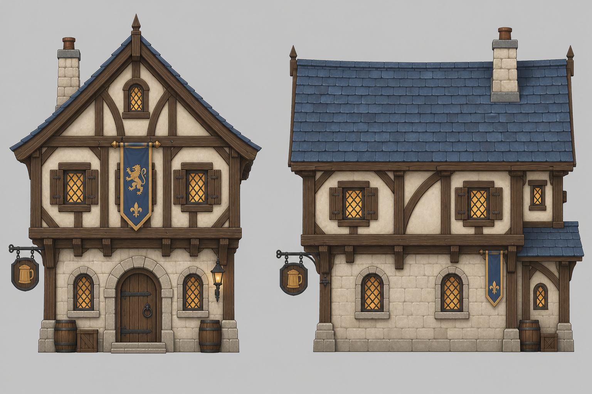

# Kingsmourn — Final Reference Pack

This folder contains the final approved visual direction.

## Characters

### Bard — Storm Skald

### Valkyr — Dark Seraph

### Necromancer — Veil Walker

### Tinker — Forge Engineer

## Gear

### Valkyr armor set

### Weapon sheet

## Environment references

### Material bible

### Tavern turnaround

### Ordinary street

### Town square

